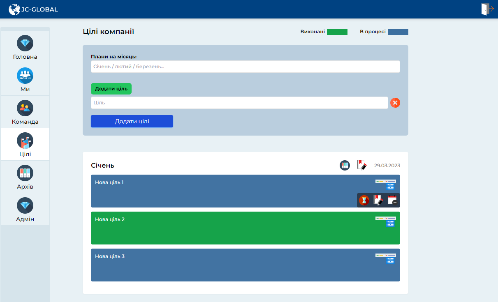
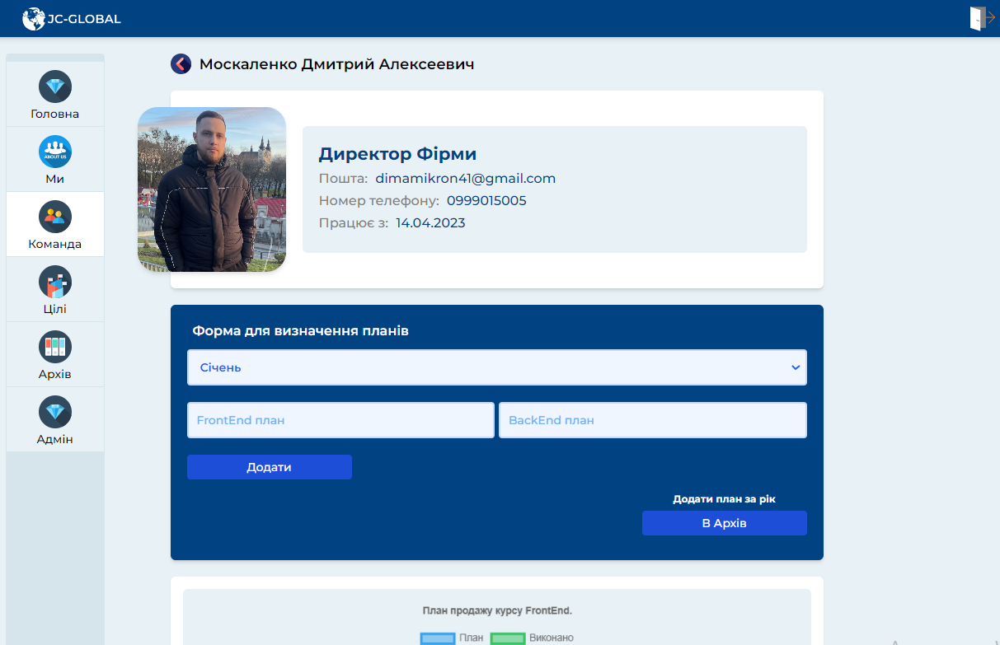
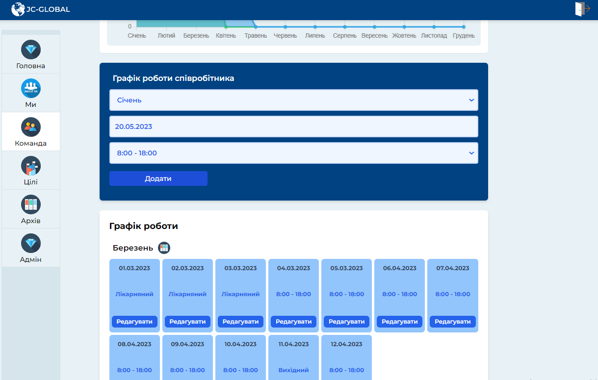

Остаток:

1. Добавление плана в архив, аналогия с графиком работы.
2. В редактировании личных данных добавить возможность редактирования фото сотрудника.
3. Решить вопрос с кол-вом отпускных дней (расчитать исходя от отработаных смен\часов)
4. 50-50: добавить возможность сброса данных плана на новый месяц к 0/0 План/Выполнение, перед установкой нового плана (либо архив)
5. "Мы", добавить ссылку или же страницу к линке (Присоедениться)
6. Варианты расширения: ("Нравится" "Супер" "Просмотрено" со списком людей посмотревших пост, или подобное на каждый Пост размещенный в ленте.)

---

Про проект. EMS (Employee Management System).

BackEnd: https://github.com/DmitryMass/JC-Global_server
FrontEnd: https://github.com/DmitryMass/JC-Global

Host для бекенд временный, может быть задержка до минуты при первом запуске.
Система управления сотрудниками. Проект относится к разделу "Рабочий сайт компании".

Система администрирования:

1. Добавления нового персонала. (Или же увольнение), различных категорий (в данном случае "Експерт \ менеджер \ бухгалтер")
2. Редактирования данных (Восстановление пароля для сотрудника, при утере)
3. Установка Целей компании (Редактирование Архивирование(в обе стороны) Удаление)
4. Удаление архивированных данных (Происходит автоматически в MongoDB)
5. Установка Планов для сотрудников (В даном случае Експертов). (Месяц + архив или онуляция)
6. Управление графиком работы сотрудника (Заблокирована возможность сотрудника отметится за другой день). Установка графика из списка смен, больничных, семейных обстоятельств и тд. Возможность редактирования каждой смены + Архивация данных графика за месяц по каждому сотруднику.
7. Добавление и управление новостями, новинками, важной информацией для персонала и чем-то новым в Ленту новостей. (Так же редактирование и удаления Поста) (Заголовок / Новость / Фотокарточки)

Система Сотрудник:

1. Просмотр текущих целей (Выполненых не выполненых), архивных целей за прошлые месяц и новостей компании.
2. Просмотр некоторых данных других сотрудников из различных отделов (Их планы, личная информация, график работы (не вся))
3. Изменение Личных персональных данных.
4. Возможность отслеживать План + Свой график работы. Возможность устанавливать текущий Выполненый план по категории.
5. Возможность Отметится в графике работ, как отработаный день (Дата в дату).

Оставляю открытым доступ:

Админ:

1. dima@dima.com
2. test12345

Сотрудник:

1. dimamikron41@gmail.com
2. test12345

// либо же ваш личный аккаунт созданый через админ панель.

etc.
